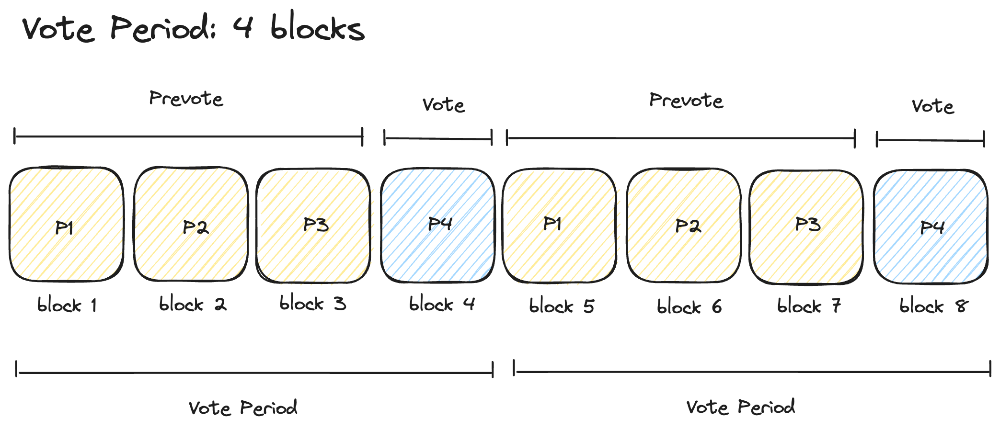

# Abstract

The `x/oracle` module equips the Settlus blockchain with real-time, accurate block height and block hash information for
external blockchains.
This enables the [`x/nftownership`](../nftownership/README.md) module to maintain precise NFT ownership data
from external chains without using a bridge.

Since block information is external to the Settlus blockchain, it relies on validators to periodically submit votes on
the most recent block data.
The protocol tallies these votes at the end of each `VotePeriod` to update the on-chain block data based on the weighted
majority.

## Contents

1. **[Concepts](#Concepts)**
   - [Voting Procedure](#voting-procedure)
   - [Reward Band](#reward)
   - [Slashing](#slashing)
   - [Abstaining from Voting](#abstaining-from-voting)
2. **[State](#State)**
   - [BlockData](#blockdata)
   - [AggregatePrevote](#aggregateprevote)
   - [AggregateVote](#aggregatevote)
   - [FeederDelegation](#feederdelegation)
   - [MissCounter](#misscounter)
3. **[EndBlock](#end-block)**
   - [Tally Exchange Rate Votes](#tally-exchange-rate-votes)
4. **[Messages](#messages)**
   - [MsgPrevote](#msgprevote)
   - [MsgVote](#msgvote)
   - [MsgFeederDelegationConsent](#msgfeederdelegationconsent)
5. **[Events](#events)**
   - TODO
6. **[Parameters](#parameters)**


# Concepts

## Chain Whitelist

Governance can modify the `Whitelist` parameter within the `x/oracle` module to manage the list of chains for which
block height and hash information—collectively known as `BlockData`, are provided.
The `Whitelist` consists of a list of `Chain` objects, each containing attributes like the chain ID, chain name, and
chain URL.

## Voting Procedure

Validators are required to submit two types of messages during each `VotePeriod`: `Vote` and `Prevote`.
Both messages should contain the current `BlockData`.
Validators must initially pre-commit to `BlockData` with a `Prevote` message.
Before the current `VotePeriod` ends, they must reveal their pre-committed `BlockData` alongside proof of the pre-commit
with a `Vote` message
This process ensures that validators commit to their choices before seeing other votes, thereby reducing centralization
and free-rider risks.

### Prevote and Vote

Let $`P_t`$ represent the current vote period in block, defined by `VotePeriod` in `oracle.proto` (currently set to 10 blocks. [1 minute]).



- A `MsgPrevote`, contains the SHA256 hash of the `BlockData` for whitelisted chains. Validators must submit a prevote
  for each chain on the whitelist.
- `MsgPrevote` can only be submitted during $`P_1, P_2, ..., P_{t-1}`$.

Prevote contains sha256 hash of block data in the following string format:

```
sha256(<salt><chain-id>:<block-number>:<block-hash>,<chain-id>:<block-number>:<block-hash>,...)
```

- A `MsgVote`, includes the salt used to generate the hash for the prevote submitted in the prevote stage.
- `MsgVote` can only be submitted during $`P_t`$.

Vote contains block data in the following string format:

```
<chain-id>:<block-number>:<block-hash>,<chain-id>:<block-number>:<block-hash>,...
```

### Vote Tally

At each $`P_t`$, the protocol tallies the votes to calculate the weighted majority $`M`$ at the `EndBlock` stage.

The submitted salt of each vote is used to verify consistency with the prevote submitted by the validator during the prevote stage.
If the validator has not submitted a prevote, or the SHA256 resulting from the salt does not match the hash from the
prevote, the vote is dropped.

For each chain, the most voted `BlockData` which has more than `VoteThreshold` total voting power is recorded on-chain
as the effective block number and block hash for the following voting period.
Chains receiving fewer than `VoteThreshold` total voting power keep the previous `BlockData` from the previous voting period.

### Ballot Rewards

After tallying, the `tally()` function identifies the winning ballots.
Voters who manage to stay within the error band $`\Delta`$ around the weighted majority $`M`$ are not slashed.
The $`\Delta`$ is governance-controlled parameter `toleratedErrorBand` in `oracle.proto`.

### Block Reorganization Handling

Block reorganization, or reorg, happens when an existing block at a specific height is replaced.
This can happen when an external chain forks.

In the event of a reorg, the current block number and hash are updated to reflect the new longest chain following
standard voting procedures.

## Reward

Reward for oracles are pooled from the fees collected from the [x/settlement](../settlement/README.md) module.

Let $`\Delta`$ be the tolerated error band, and $`M`$ be the weighted majority of the votes.
Votes within the range $`[ M - \Delta, M + \Delta ]`$ qualify for rewards.
Validators failing to vote within this band are subject to slashing penalties.

## Slashing
The following events are considered a "miss":

- The validator fails to submit a vote for the current `BlockData` against **each and every** chain specified
  in `Whitelist`.
- The validator fails to vote within the `reward band` around the weighted majority for one or more chains.

During every `SlashWindow`, participating validators must maintain a valid vote rate of at
least `MinValidPercentPerSlashWindow` (currently set to 50%).
If the validator fails to maintain a valid vote rate, the validator is slashed by `SlashFraction` (currently set to 1%).
The slashed validator is automatically temporarily "jailed" by the protocol (to protect the funds of delegators), and
the operator is expected to fix the discrepancy promptly to resume validator participation.

## Abstaining from Voting

A validator may abstain from voting by submitting a non-positive integer for the `BlockData` field in `MsgVote`.
Doing so will absolve them of any penalties for missing `VotePeriod`s, but also disqualify them from receiving Oracle
rewards for faithful reporting.

# State

## BlockData

`BlockData` contains whitelisted chains' block number and hash for the current `VotePeriod`.

- `BlockData`: `chainId -> BlockData`

```go
type BlockData struct {
    ChainId string
    BlockNumber uint64
    BlockHash string
}
```

## AggregatePrevote

`AggregatePrevote` contains validator's aggregated prevotes.
Hash is a sha256 hash of salt + `BlockData` in the following string format:

```
<salt><chain-id>:<block-number>:<block-hash>,<chain-id>:<block-number>:<block-hash>,...
```

- `AggregatePrevote`: `valAddress -> AggregatePrevote`

```go
type AggregatePrevote struct {
    Hash        string
    Voter       string    // Voter validator address 
    SubmitBlock int64
}
```

## AggregateVote

`AggregateVote` contains validator's aggregated votes.

- `AggregateVote`: `valAddress -> AggregateVote`

```go
type AggregateVote struct {
    repeated BlockData BlockData
    Voter    string // voter val address of validator
}
```

## FeederDelegation

An `sdk.AccAddress` (`setl-` account) address of `validator`'s delegated price feeder.

- FeederDelegation: `valAddress -> sdk.AccAddress`

```go
type FeederDelegation struct {
    FeederAddress string
    ValidatorAddress string
}
```

## MissCount

An `int64` representing the number of `VotePeriods` that validator `operator` missed during the current `SlashWindow`.

- MissCount: `valAddress -> uint64`

```go
type MissCount struct {
    ValidatorAddress string
    MissCount uint64
}
```

# End Block

## Tally Block Data Votes

At the end of every block, the `x/oracle` module checks whether it's the last block of the `VotePeriod`.
If it is, it runs the [Voting Procedure](#voting-procedure):

1. Received votes are organized into ballots by chain IDs. Abstained votes, as well as votes by inactive or jailed
   validators are ignored.

2. Chain IDs not meeting the following requirements will be dropped:

    - Must appear in the permitted chain ID in `Whitelist` parameter.
    - Ballot for chain ID must have at least `VoteThreshold` total vote power.

3. For each remaining `ChainId` with a passing ballot:

    - Tally up votes and find the weighted majority `BlockData` and winners with `tally()`.
    - Iterate through winners of the ballot and add their weight to their running total.
    - Store the updated `BlockData` on the blockchain for that `ChainId` with keeper `k.SetBlockData()`.
    - Emit a `BlockDataUpdate` event.

4. Count up the validators who [missed](#misscount) the Oracle vote and increase the appropriate miss
   counters.

5. If at the end of a `SlashWindow`, penalize validators who have missed more than the penalty threshold (submitted
   fewer valid votes than `MinValidPercentPerSlashWindow`)

6. Distribute rewards to ballot winners with `k.RewardBallotWinners()`

7. Clear all prevotes (except ones for the next `VotePeriod`) and votes from the store

# Messages

## MsgPrevote

`Hash` is a hex string generated the SHA256 hash (hex string) of a string with the following format:

```
<salt><chain-id>:<block-number>:<block-hash>,<chain-id>:<block-number>:<block-hash>,...
```

Note that in the subsequent `MsgVote`, the salt will have to be revealed.
The salt used must be regenerated for each prevote submission.

```go
type MsgPrevote struct {
    Feeder    string
    Validator string
    Hash string
}
```

## MsgVote

The `MsgVote` contains the actual exchange rates vote.
The `Salt` parameter must match the salt used to create the prevote, otherwise the voter cannot be rewarded.
The `BlockData` field contains the block number and block hash of the block for each chain ID in the whitelist.

```go
type MsgVote struct {
    Feeder    string
    Validator string
	BlockData *BlockData
    Salt      string
}
```

## MsgFeederDelegationConsent

Validators may elect to delegate voting rights to another key to prevent the block signing key from being kept online.
To do so, they must submit a `MsgFeederDelegationConsent`, delegating their oracle voting rights to a `Delegate` that
sign `MsgPrevote` and `MsgVote` on behalf of the validator.

The `Validator` field contains the operator address of the validator (prefixed `setlvaloper-`).
The `FeederAddress` field is the account address (prefixed `setl-`) of the delegate account that will be submitting
votes and prevotes on behalf of the `Validator`.

```go
type MsgDelegateFeedConsent struct {
	Validator string
	FeederAddress string
}
```

# Events

TODO

The oracle module emits the following events:

## EndBlocker

## Handlers

### MsgPrevote

### MsgVote

### MsgFeederDelegationConsent

# Parameters

The oracle module contains the following parameters:

| Key                        | Type    | Example                                                                          |
|----------------------------|---------|----------------------------------------------------------------------------------|
| votePeriod                 | int     | 3                                                                                |
| voteThreshold              | dec     | "0.500000000000000000"                                                           |
| toleratedErrorBand         | int     | 2                                                                                |
| whitelist                  | []Chain | [{"chainId": "1", "chainName": "ethereum", "chainUrl": "https://ethereum.org/"}] |
| slashFraction              | dec     | "0.001000000000000000"                                                           |
| slashWindow                | int     | 100                                                                              |
| maxMissCountPerSlashWindow | int     | 10                                                                               |

## Validations
- `votePeriod` must be larger than 0.
- `voteThreshold` must be larger than 0.5.
- `toleratedErrorBand` must be less than 10. However, 10 is an arbitrary number and can be changed in the future.
- Chains in `whitelist` must have unique chain ids.
- `slashFraction` must be larger than 0 and less than 0.1.
- `slashWindow` must be larger than 0 and divisible by the `votePeriod`.
- `maxMissCountPerSlashWindow` must be less than the `slashWindow`.
